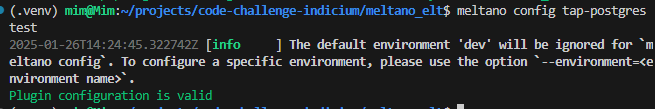
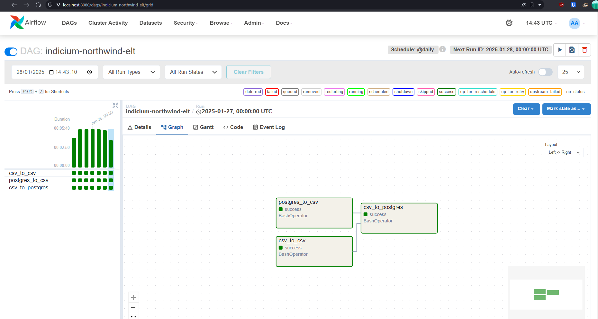
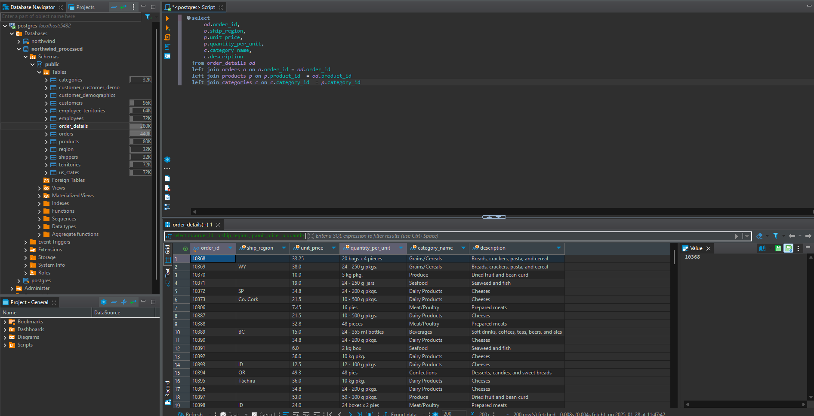

# Indicium - desafio de engenharia de dados

Este repositório contém a solução do [desafio de engenharia]([https://github.com/TinyHero13/code-challenge-indicium/blob/main/README.md](https://github.com/TinyHero13/LH_ED_YASMIM/blob/main/README_challenge.md)) de dados proposto pela Indicium. A solução implementa uma pipeline de dados utilizando as ferramentas Meltano e Apache Airflow, além de um banco de dados PostgreSQL.

## 📑 Descrição do Desafio
O desafio consiste em construir uma pipeline que:

- Extrai dados de duas fontes: um banco PostgreSQL (Northwind) e um arquivo CSV.
- Escreve os dados localmente, organizados por fonte (csv ou postgres), tabela e data de execução.
- Carrega os dados do armazenamento local para um banco de dados PostgreSQL.
- Garante que os dados sejam processados de forma independente e rastreável, com suporte para reprocessamento de datas anteriores.

## 🛠 Ferramentas Utilizadas

- Python: 3.11.5
- Meltano: 3.6.0
- Apache Airflow: 2.10.4
- PostgreSQL: banco northwind e banco de destino northwind_processed.

## 🖥️ Configuração do Ambiente

### 1 - Instale as dependências
Clone o repositório e instale as dependências do Python:

```bash
git clone https://github.com/TinyHero13/code-challenge-indicium.git
cd code-challenge-indicium
pip install -r requirements.txt
```

Entre no diretório do meltano e instale suas dependências:

```bash
cd meltano_elt
meltano install
```

### 2 - Configure o Apache Airflow
Inicialize o Airflow com os comandos abaixo:

``` bash
meltano invoke airflow:initialize
meltano invoke airflow users create -u admin@localhost -p password --role Admin -e admin@localhost -f admin -l admin
meltano invoke airflow scheduler
meltano invoke airflow webserver
```

A interface do Airflow estará disponível em: http://localhost:8080

### 3 - Configure o banco de dados PostgreSQL
Inicie o banco de dados northwind que está no docker-compose.yml:
```bash
docker-compose up -d
```

E crie o banco de destino para os dados processados:
```SQL
CREATE DATABASE northwind_processed;
```

E configure o tap-postgres do meltano que já vem ao instalar as dependências do meltano no passo 1.
```bash
meltano config tap-postgres set database northwind
meltano config tap-postgres set host localhost
meltano config tap-postgres set port 5432
meltano config tap-postgres set user northwind_user
meltano config tap-postgres set password thewindisblowing
```

A partir disso o tap-postgres já está configurado e é possível testar para verificar se está tudo certinho.
```bash
meltano config tap-postgres test
```


Além de configurar para o target-postgres
```bash
meltano config target-postgres set database northwind_processed
meltano config target-postgres set host localhost
meltano config target-postgres set port 5432
meltano config target-postgres set user northwind_user
meltano config target-postgres set password thewindisblowing
```

### 4 - Alteração no Diretório Raiz da DAG
Para que a DAG funcione corretamente, é necessário ajustar o caminho do diretório raiz do projeto. A única modificação necessária é atualizar a variável PROJECT_ROOT no arquivo da DAG indicium_elt para refletir o caminho atual do projeto no seu ambiente.

```
PROJECT_ROOT = '/seu/diretorio/atual/do/projeto'
```

### 5 - Execute a DAG
Após as configurações já é possível executar a DAG, que pode ser feito tanto pela UI do Airflow, ou por linha de comando
```bash
meltano invoke airflow dags trigger indicium-northwind-elt
```

Sendo possível até exectuar de uma data anterior
```bash
meltano invoke airflow dags trigger -e 2025-01-20 indicium-northwind-elt
```



## 📊 Resultado Final
Após a execução do pipeline, os dados são carregados no banco de dados PostgreSQL e organizados em tabelas relacionais, permitindo consultas que combinem tabelas que não estavam presentes no banco inicial.

Por exemplo, é possível executar a consulta que relaciona a order_details com demais tabelas.


```SQL
SELECT 
    od.order_id,
    o.ship_region,
    p.unit_price,
    p.quantity_per_unit,
    c.category_name,
    c.description
FROM 
    order_details od
LEFT JOIN 
    orders o ON o.order_id = od.order_id
LEFT JOIN 
    products p ON p.product_id = od.product_id
LEFT JOIN 
    categories c ON c.category_id = p.category_id;
````
